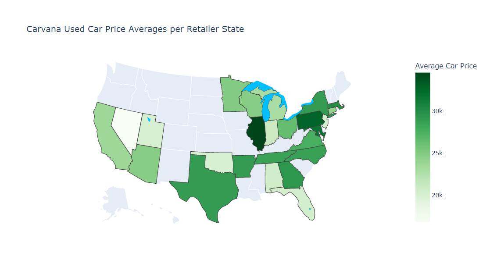
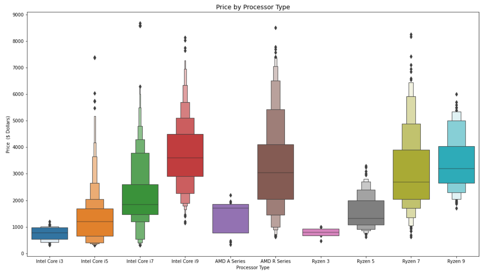
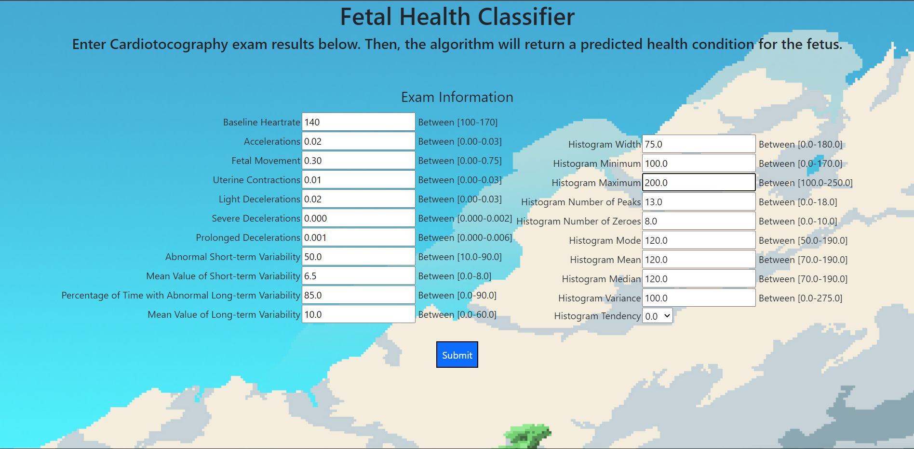
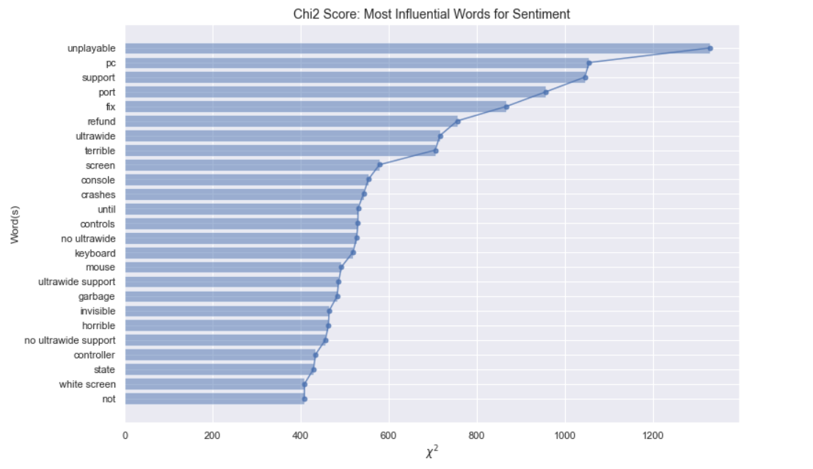
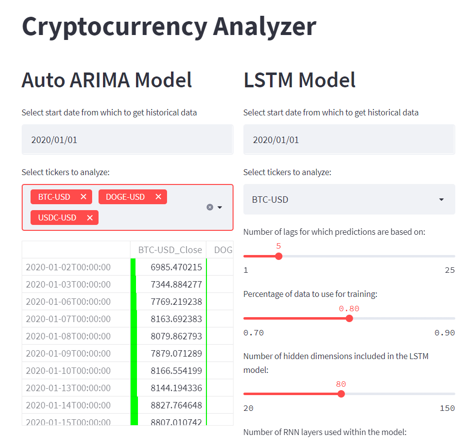
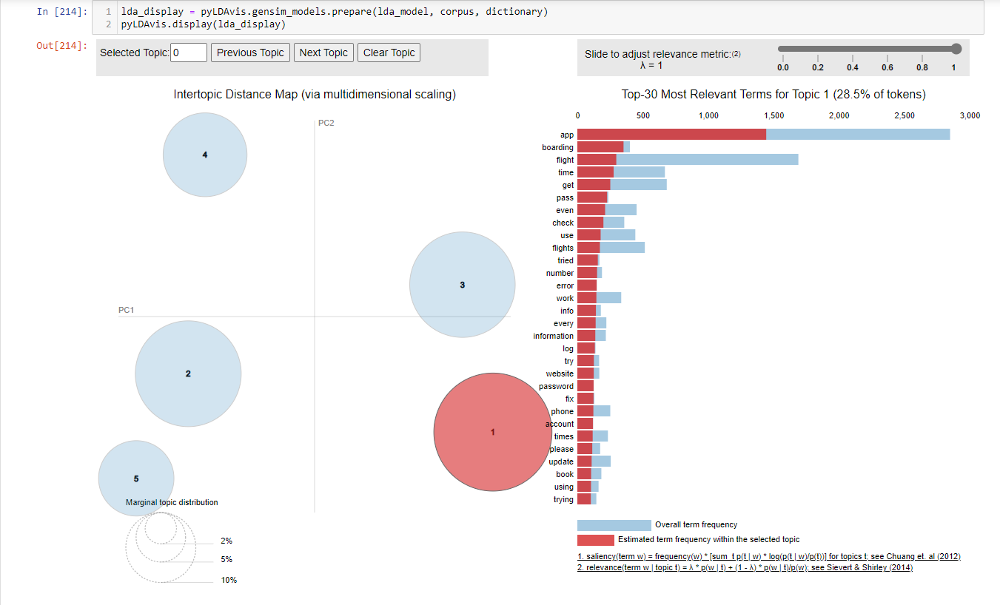
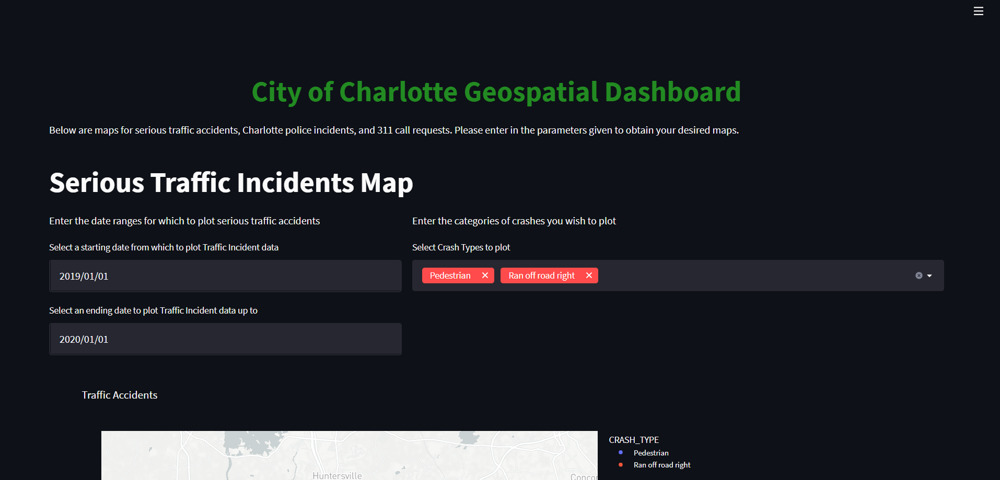
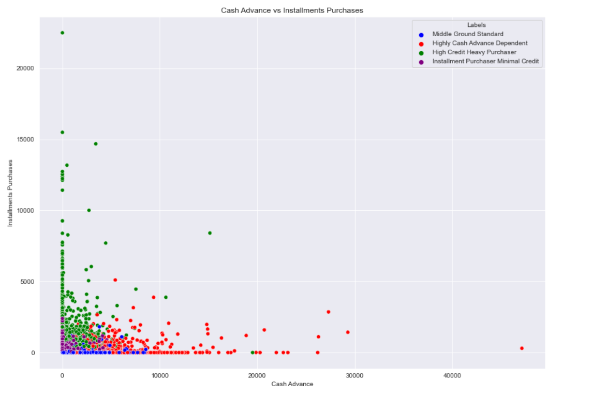

# Data Science Project Portfolio
Welcome to my project portfolio! Click on any of the project titles to go to an individual project's repository.

# [Project 1) Carvana Cars Regression Project:](https://github.com/elayer/CarvanaCarsProject)
* Created a model base to help those considering selling or trading in their car to Carvana get an idea of what price they can expect.

* Scraped roughly two thousand pages of car data from Carvana's used car listings using a custom-built web scraper. 

* Cleaned and processed the data for preparation for EDA and model building tasks. Tasks ranged from imputing missing values to feature engineering new versions of variables which had high cardinality. I also performed some outlier detections techniques using PyCaret as well as Z-score.

* Within Model Building, I began by dropping insignificant attributes as well as variables exhibiting multicollinearity. After using the OLS method from statsmodels, I moved into applying linear regression techniques such as standard Linear Regression, Elastic Net, and Kernel Ridge. I followed this up by applying more powerful models such as Random Forest, LightGBM, and XGBoost regression.

# [Project 2) Amazon Gaming Computer Price Estimator:](https://github.com/elayer/Amazon-Computer-Project)
* Created a model to help those looking to buy a gaming computer from Amazon make a more informed decision based on the specs of a computer.

* Scraped roughly 200 pages of gaming desktop product listing information from Amazon with a custom-built web scraper. 

* Engineered a few features based on the product information included in the title of a product listing. Such as features for liquid cooling and bluetooth capability.

* Began model building with Linear, Lasso, Ridge, and ElasticNet linear models, as well Random Forest regression. Then, built optimized models using Optuna with XGBoost and CatBoost regression.

* Created an API for potential clients using Flask with functional HTML pages for local use. 

# [Project 3) Fetal Health Condition Classifier:](https://github.com/elayer/Fetal-Health-Classifier-Project)
* Created a model to classify for babies in fetal development, cardiotocography exams on whether the fetus has normal health conditions, is suspect of having some pathology, or has some pathological condition.  

* Engineered new features utilizing Linear Discriminant Analysis and KMeans Clustering. I also performed PCA to orchestrate further and visualize further class separability.

* Began model building with Support Vector Machine, K-Nearest Neighbors, Logistic Regression, Random Forest Classifier, and AdaBoost Classifier. I then used optuna for hyperparameter optmimization with XGBoost Classifier and CatBoost Classifier.

* Created an API for potential clients using Flask with functional HTML pages for local use.

# [Project 4) Elden Ring Reviews Sentiment Analysis & Classification Project:](https://github.com/elayer/Steam-Elden-Ring-Reviews-Project)
* Scraped roughly two hundred thousand reviews from Steam on the game <i>'Elden Ring'</i>. 

* Tokenized the review text to conduct N-Gram analysis, create word clouds, and construct data to be fed into NLP models (namely Sentiment Analysis).

* To perform Sentiment Classification, I began model building by using Naive Bayes, SGD Classifier and Logistic Regression. Following this, I built a deep learning PyTorch model utilizing HuggingFace transformers. I chose the RoBERTa model for its optimized and robust performance.

* Lastly, to analyze the topics of discussion among the apps to track down potential areas of game improvement and reception of the game itself, I performed 
LDA (Latent Dirichlet Analysis) and LSA (Latent Semantic Analysis) to extract topic information and key distinguishing words in the text corpus.

# [Project 5) Cryptocurrency Time Series Project:](https://github.com/elayer/CryptoTimeSeriesProject)
* Created functions to automatically scrape Yahoo! Finance cryptocurrency tickers that the user chooses, collecting data from the current day back to 
January 1st, 2017. 

* Explored various cryptocurrency trends and their possible influence by Russia's invasion of Ukraine.

* Using BTC data (BitCoin), explored various time series algorithms, such as AR, MA, ARCH and ARIMA to investigate the best model to graph the data. Eventually found that utilizing exogenous data with Auto ARIMA generates models that follow the data very closely.

* As a follow up, I then made an LSTM model with PyTorch to forecast cryptocurrency values.

* Lastly, I constructed a StreamLit app allowing users to create Auto ARIMA and LSTM models and juxtapose their predictive power. The app allows users to choose date ranges to collect data, which crypto tickers to analyze, and from a chosen date to make predictions (currently can run locally).

# [Project 6) American Airlines Mobile App Reviews Analysis:](https://github.com/elayer/American-Airlines-Mobile-App-Reviews-Analysis)
* The goal of this project was to collect as many samples of reviews from American Airlines' mobile application as possible and find common issues that customers may be facing when using the application.

* Scraped approximately 3700 reviews from the American Airlines mobile application off of the Apple App store. 

* Prior to performing analysis tasks, I used nltk and string methods to tokenize the reviews data.

* Following tokenization, I applied a wide range of analysis techniques to the text data of reviews. These including N-gram analysis, t-SNE for word exploration, Latent Dirichlet Analysis (LDA) to identify common topics within the data, as well as LIME and SHAP to investigate word impact on rating/sentiment as well as potentially towards the topics LDA identified.

* I applied lime and shap with the target being the rating (ranging from 1 to 5) as well as the topics generated from LDA when applied to all reviews.

# [Project 7) City of Charlotte Geospatial Dashboard Project:](https://github.com/elayer/CharlotteGeospatialDashboard)
* Collected 3 areas of data tracked by the City of Charlotte found on the city's website (Serious Traffic Accidents, Police Incidents, 311 Call Requests.

* Cleaned and processed the data when ncessary, such as creating date columns or filtering out locations outside of Charlotte, North Carolina. Conducted some EDA in attempt to pick up any initial findings as a base to inspire parameter decision when creating maps.

* Created a StreamLit application to consolidate all geospatial maps into one dashboard.

# [Project 8) Credit Card Clustering Project:](https://github.com/elayer/CreditCardClusteringProject)
* In this project, I attempt to split a credit card dataset I obtained through Kaggle into clusters and give the customers appropriate labels which could 
be used toward business decisions or marketing efforts.

* After ingesting the data, I performed some data cleaning by checking for null values and ensuring columns had appropriate data types.

* I then performed EDA by using correlation and bivariate analysis techniques. As one would expect, those with higher balance had a higher credit limit, and just about 
all frequency attributes were positively correlated with their general attribute counterpart.

* Applied K-Means with PCA and UMAP to the data in attempt to create appropriate clusters based on the data. 

* Using a scree plot/elbow method, I elected to use 4 clusters to split the data. I found that 4 clusters represented the data fairly well with PCA, and UMAP was an upgrade from PCA in that the 4 clusters were split more elaborately and group size was much more balanced (the below picture illustrates a split one two attributes using UMAP as the dimensionality reduction technique).

